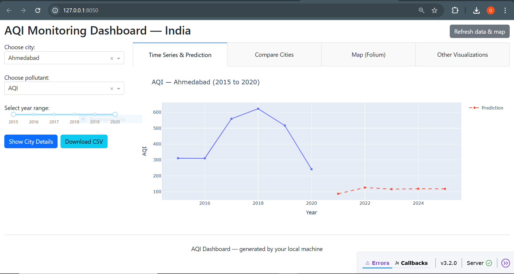
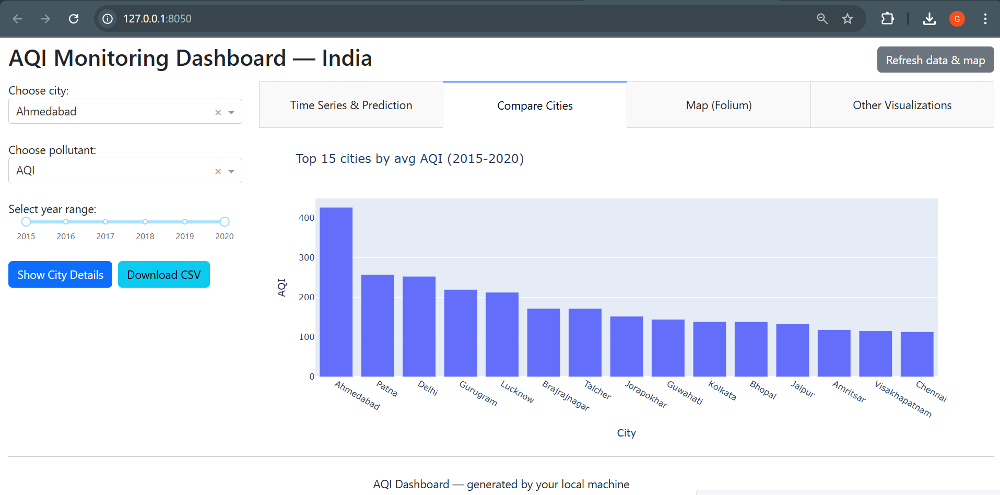
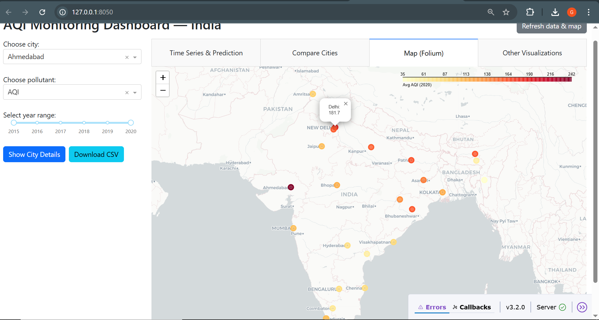
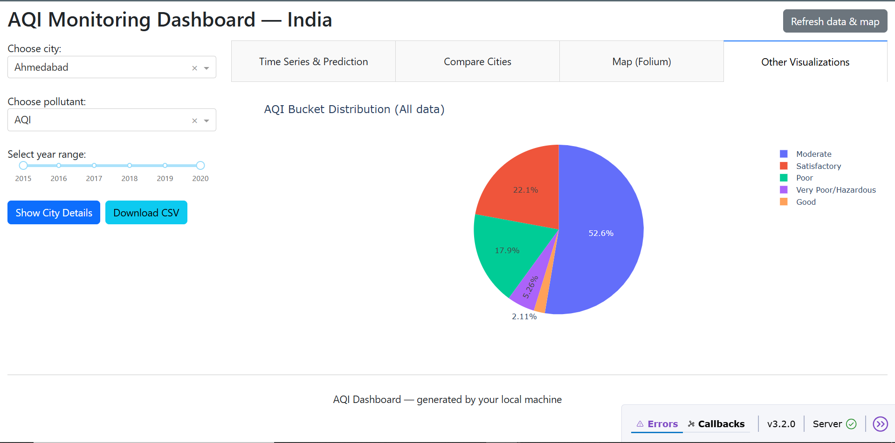
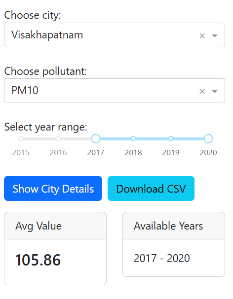

# 🌍 AQI Dashboard — Advanced Air Quality Visualizer

 
 
  
  


---

## 📌 Overview
The **AQI Dashboard** is a professional and interactive web application to **analyze, monitor, and forecast Air Quality Index (AQI)** across Indian cities.  
It leverages **Dash (Plotly)** for interactive dashboards, **Folium** for geographic mapping, and **ARIMA/ML models** for future predictions.  

This project is designed for:
- 🌱 Environmental researchers  
- 📊 Data science enthusiasts  
- 🏫 Academic projects and portfolios  

---

## ✨ Features
✔️ Year-wise interactive AQI & pollutant visualizations  
✔️ Compare multiple cities side-by-side  
✔️ Interactive India map with AQI-based coloring  
✔️ Export filtered datasets as CSV  
✔️ Predictive modeling with **ARIMA** (auto fallback to Linear Regression)  
✔️ User-friendly & responsive interface built with Dash  

---

## 📊 Dataset
We use the Kaggle dataset:  
👉 [Air Quality Data in India (city_day.csv)](https://www.kaggle.com/datasets/rohanrao/air-quality-data-in-india)  

Place the dataset in the `data/` folder as:  data/city_day.csv

---

## 🛠️ Tech Stack
- **Python 3.8+**
- [Dash (Plotly)](https://dash.plotly.com/) → Interactive dashboard UI  
- [Pandas](https://pandas.pydata.org/) → Data preprocessing & wrangling  
- [Folium](https://python-visualization.github.io/folium/) → Geographic visualization  
- [Statsmodels](https://www.statsmodels.org/) → ARIMA forecasting  
- [scikit-learn](https://scikit-learn.org/) → ML fallback regression models  

---

## 🚀 Installation & Setup

### 1️⃣ Clone this repository
```bash
git clone https://github.com/<your-username>/AQI-Dashboard.git
cd AQI-Dashboard
```

### 2️⃣ Create & activate a virtual environment
Windows (PowerShell):
```bash
python -m venv .venv
.venv\Scripts\activate
```
Linux/Mac:
```bash
python3 -m venv .venv
source .venv/bin/activate
```

### 3️⃣ Install dependencies
```bash
pip install -r requirements.txt
```
### 4️⃣ Run preprocessing & map generation
```bash
python data_processing.py
python geocode_cities.py   # optional — requires internet
python generate_map.py
```

### 5️⃣ Launch the dashboard
```bash
python app.py
```
Now open your browser at 👉 http://127.0.0.1:8050

---

## 📷 Screenshots
<p align="center">
 
  <br>
  
  <br>
 
  <br>
 
  <br>
 
  <br>
</p>

---
## �️ Project Structure

```
├── app.py
├── data/
│   └── city_day.csv
│   └── city_coords.csv
│   └── processed_city_yearly.csv
├── screenshots/
│   └── ss1.png
│   └── ss2.png
│   └── ss3.png
│   └── ss4.png
│   └── ss5.png
├── assets/
│   └── map.html
├── data_processing.py
├── generate_map.py
├── geocode_cities.py
├── requirements.txt
└── README.md
└── LICENSE

```
---

## 📈 Future Enhancements
- ⏳ Support for monthly/daily AQI trends
- 📡 Real-time AQI data integration (API-based)
- 🤖 Advanced forecasting with Prophet / LSTM models
- ☁️ Cloud deployment (Heroku / Render / AWS)

---

## 🤝 Contributing
Contributions are always welcome!
- Fork the project
- Create a new branch (feature-new)
- Commit your changes
- Open a Pull Request

---

## 📜 License
This project is licensed under the MIT License - see the [LICENSE](LICENSE) file for details.

---

## 👨‍💻 Author
- G Yugesh Kumar

- 📧 Email: gyugeshkumar2005@gmail.com

- 🌐 LinkedIn: [gyugeshkumar](https://www.linkedin.com/in/gyugeshkumar)

